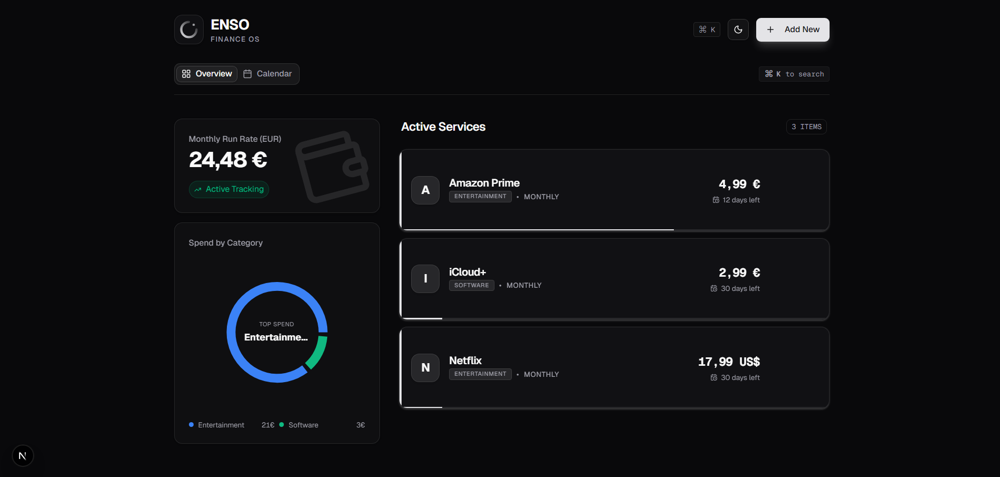

# ENSO | Finance OS

<div align="center">
  <br />
  <a href="https://enso-three.vercel.app/">
    <h1 align="center" style="font-size: 3rem; font-weight: 900;">ENSO</h1>
  </a>
  
  <p align="center">
    <strong>Master your recurring expenses. Privacy-first. Local-first.</strong>
  </p>

  <p align="center">
    <a href="https://nextjs.org">
      
    </a>
    <a href="https://www.typescriptlang.org/">
      
    </a>
    <a href="https://tailwindcss.com/">
      
    </a>
    <a href="https://dexie.org/">
      
    </a>
  </p>
</div>

<br />



> _Note: Replace this image with a real screenshot of your dashboard named 'dashboard-screenshot.png' in the public folder._

## ✨ Introduction

**ENSO** is a modern, privacy-focused subscription manager designed to stop you from bleeding money on forgotten services.

Unlike other finance apps, **ENSO has no backend**. It leverages the browser's **IndexedDB** to store all your sensitive financial data locally on your device. We cannot see your data, sell it, or leak it.

It features a high-performance **Command Palette (God Mode)**, intelligent **Calendar Views**, and **Smart Notifications** that alert you before a payment hits your card.

## 🚀 Key Features

- **🛡️ Local-First Architecture:** Built with Dexie.js (IndexedDB). Data never leaves your browser.
- **⚡ God Mode (Cmd+K):** Navigate, search, and manage subscriptions without touching the mouse.
- **📅 Visual Calendar:** A monthly grid view to visualize spending clusters and renewal dates.
- **🔔 Smart Notifications:** Native system alerts 3 days before any payment is due (Serverless logic).
- **🌍 Multi-Currency Support:** Track in USD, EUR, or GBP with real-time normalization for KPIs.
- **🎨 Dark/Light Mode:** Beautifully crafted UI with "Midnight Glass" aesthetics using Tailwind CSS & Shadcn.
- **📊 Interactive Analytics:** Monthly Run Rate (MRR) calculation and category distribution charts using Recharts.

## 🛠️ Tech Stack

- **Framework:** [Next.js 16](https://nextjs.org/) (App Router)
- **Language:** TypeScript
- **Styling:** Tailwind CSS, Framer Motion, `clsx`
- **UI Components:** [Shadcn UI](https://ui.shadcn.com/) (Radix Primitives)
- **State Management:** Zustand (Global Store)
- **Database:** Dexie.js (Wrapper for IndexedDB)
- **Forms:** React Hook Form + Zod Validation
- **Charts:** Recharts

## 📦 Getting Started

Follow these steps to run ENSO locally on your machine.

### Prerequisites

- Node.js 18+
- pnpm (recommended) or npm/yarn

### Installation

1. **Clone the repository**

```bash
git clone https://github.com/EdvinCodes/enso.git
cd enso
```

2. **Install dependencies**

```bash
pnpm install
```

3. **Run the development server**

```bash
pnpm dev
```

4. **Open your browser**
   Navigate to [http://localhost:3000](https://www.google.com/search?q=http://localhost:3000) to see the Landing Page.
   Click "Launch App" to access the Dashboard.

## 📂 Project Structure

```bash
src/
├── app/
│   ├── page.tsx            # Landing Page (Marketing)
│   ├── dashboard/          # The actual App (Protected route logic)
│   └── globals.css         # Tailwind & Global Styles
├── components/
│   ├── ui/                 # Shadcn reusable components (Button, Card, etc.)
│   └── command-menu.tsx    # God Mode implementation
├── features/
│   ├── subscriptions/      # Core Domain Logic (Components, Store, Schema)
│   └── calendar/           # Calendar View Logic
├── lib/
│   ├── db.ts               # Database configuration (Dexie)
│   ├── notifications.ts    # Notification API Logic
│   └── currency.ts         # Currency conversion helpers
└── hooks/                  # Custom React Hooks (useSmartNotifications)
```

## 🔮 Roadmap

- [x] Core Subscription Management (CRUD)
- [x] Local Storage Persistence
- [x] Dashboard & Calendar Views
- [x] Smart Notifications
- [ ] PWA Support (Install on Mobile)
- [ ] End-to-End Encryption Sync

## 🤝 Contributing

Contributions are welcome! If you find a bug or have a feature request, please open an issue.

1. Fork the Project
2. Create your Feature Branch (`git checkout -b feature/AmazingFeature`)
3. Commit your Changes (`git commit -m 'Add some AmazingFeature'`)
4. Push to the Branch (`git push origin feature/AmazingFeature`)
5. Open a Pull Request

## 📄 License

Distributed under the MIT License. See `LICENSE` for more information.

---

<div align="center">
<p>Built with ❤️ by <a href="https://github.com/EdvinCodes">Edvin</a></p>
</div>
